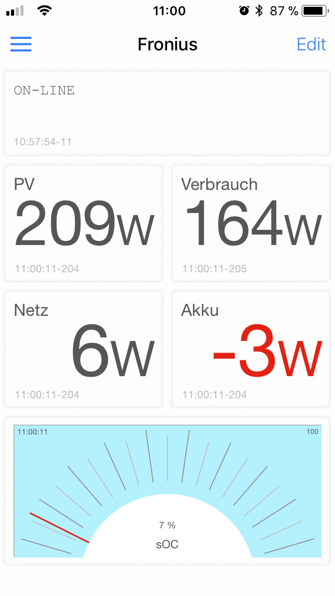

# Setup

To have faster access to the Fronius Realtime Date, without using solar.web and their app,
I have a [mosquitto](https://mosquitto.org) MQTT broker running on a Raspberry Pi and I am using
the [IoT OnOff](https://www.iot-onoff.com) app for visualizing its data.
On the Pi these scripts here runs in a loop to fetch data from the Fronius API an publish it to mosquitto every 2 seconds.



# Running as a service

On my raspian I use supervisor to run the connectors as a service with the config files found in the supervisor directory.

To update supervisor with changes run

```
supervisorctl reread
supervisorctl update
```
